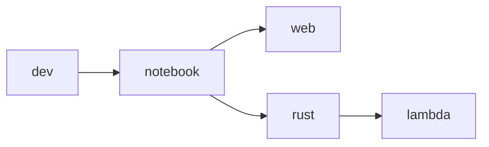

Development with Containers
===========================

Quick Start
-----------

Use VS Code in the browser in **Three Easy Steps™**

1. Install [Docker](https://docs.docker.com/get-docker/) or [Podman](https://podman.io/)
2. Run the command <sup>[1](#1)</sup>
    ```shell
    docker run -it \
        --privileged \
        --name notebook \
        --hostname $(hostname) \
        ghcr.io/jhwohlgemuth/notebook
    ```
3. Open a browser and navigate to [https://localhost:1337](https://localhost:1337) <sup>[2](#2)</sup>

Environment for Software Correctness
------------------------------------
> 🚧 UNDER CONSTRUCTION

Container Customization
-----------------------
> [!NOTE]
> Use [`install_extensions`](./code-server/install_extensions.sh) to install VS Code extensions.

> [!NOTE]
> [`install_extensions`](./code-server/install_extensions.sh) accepts any number of image names (see [Image Design section](#image-design))</br>
> *Example* `install_extensions notebook dotnet web`

The following environment variables are available to customize containers:
- `CODE_SERVER_CONFIG`: Location of code-server server configuration file (within container)
  - Default: `/app/code-server/config/config.yaml`
- `CODE_SERVER_PORT`: Port to use for code-server server
  - Default: `1337`
- `CODE_SERVER_PASSWORD`: Password to use for code-server server
  - Default: `password`
- `JUPYTER_CONFIG`: Location of code-server server configuration file (within container)
  - Default: `/root/.jupyter/jupyter_notebook_config.py`
- `JUPYTER_PORT`: Port to use for Jupyter server
  - Default: `13337`
- `JUPYTER_PASSWORD_HASH`: Password to use for Jupyter server
  - Default: `password`

> [!TIP]
> Change environment variables with the `--env` parameter <sup>[3](#3)</sup> (ex. `docker run -it --env CODE_SERVER_PORT=8080 <image>`)

Image Design
------------
> [!NOTE]
> Images are built using GitHub Actions and deployed to the Github Container Registry, `ghcr.io`, under the username, `jhwohlgemuth`

The following images are available:
- `ghcr.io/jhwohlgemuth/dev`: Core image with all necessary system dependencies (intended for **dev**elopment)
- `ghcr.io/jhwohlgemuth/notebook`: Images with [Jupyter notebook](https://github.com/jupyter/notebook) server and [code-server](https://github.com/coder/code-server) services managed by [s6-overlay](https://github.com/just-containers/s6-overlay)
- `ghcr.io/jhwohlgemuth/web`: Web development environment and [Verdaccio](https://verdaccio.org/) proxy npm registry <sup>[4](#4)</sup>
- `ghcr.io/jhwohlgemuth/rust`: Environment ready for writing Rust code and working with WebAssembly
- `ghcr.io/jhwohlgemuth/lambda`: Proof assistants, provers, and other tools for software correctness

The images are build according the the following dependency graph:


-------------

**Footnotes**
-------------

[1]
---
> `--privileged` is required to use [Apptainer](https://github.com/apptainer/apptainer) within the container

[2]
---
> The default code-server port can be changed with the `CODE_SERVER_PORT` environment variable. See the [Container Customization section](#container-customization) for more details.

[3]
---
> See [docker run documentation](https://docs.docker.com/engine/reference/commandline/container_run/)

[4]
---
> Default Verdaccio proxy npm registry port is `4873` ([documentation](https://verdaccio.org/docs/configuration#listen-port))
