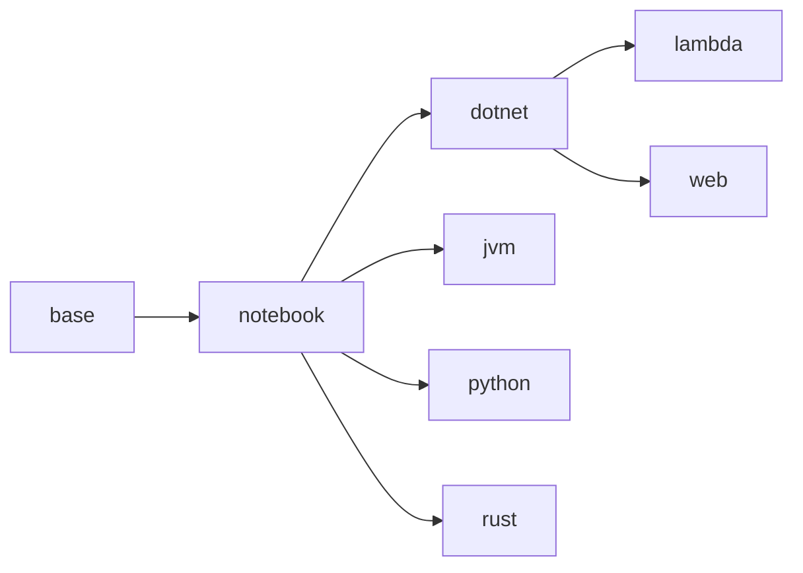

Development with Containers
===========================

Quick Start
-----------

Use VS Code in the browser in **Three Easy Steps™**

1. Install [Docker](https://docs.docker.com/get-docker/) or [Podman](https://podman.io/)
2. Run the command
    ```shell
    docker run -it \
        --name notebook \
        -p 1337:1337 \
        -p 4873:4873 \
        -p 13337:13337 \
        ghcr.io/jhwohlgemuth/web
    ```
3. Open a browser and navigate to [https://localhost:1337](https://localhost:1337)

Container Customization
-----------------------
> **Note**

> Use [`install_extensions`](./code-server/install_extensions) to install VS Code extensions. `install_extensions` accepts any number of image names (see [Image Design section](#image-design))

The following environment variables are available to customize containers:
- `CODE_SERVER_CONFIG`: Location of code-server server configuration file (within container)
  - Default: `/app/code-server/config/config.yaml`
- `CODE_SERVER_PORT`: Port to use for code-server server
  - Default: `1337`
- `CODE_SERVER_PASSWORD`: Password to use for code-server server
  - Default: `password`
- `JUPYTER_CONFIG`: Location of code-server server configuration file (within container)
  - Default: `/root/.jupyter/jupyter_notebook_config.py`
- `JUPYTER_PORT`: Port to use for Jupyter server
  - Default: `13337`
- `JUPYTER_PASSWORD_HASH`: Password to use for Jupyter server
  - Default: `password`


Image Design
------------
> Images are built using GitHub Actions and deployed to the Github Container Registry, `ghcr.io`, under the username, `jhwohlgemuth`

The following images are available:
- `base`: Core image with all necessary system dependencies
- `notebook`: Images with [Jupyter notebook](https://github.com/jupyter/notebook) server and [code-server](https://github.com/coder/code-server) services managed by [s6-overlay](https://github.com/just-containers/s6-overlay)
- `dotnet`: .NET development environment
- `jvm`: Java Virtual Machine development environment
- `python`: Image with Python tools and Jupyter kernels
- `lambda`: Functional programming languages and Jupyter kernels
- `rust`: Rust and WebAssembly environment
- `web`: Web development environment

The images are build according the the following dependency graph:


